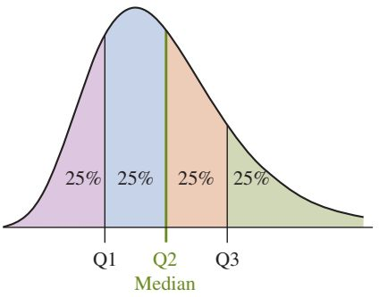
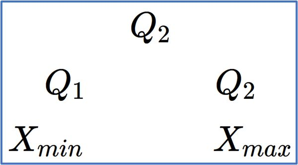
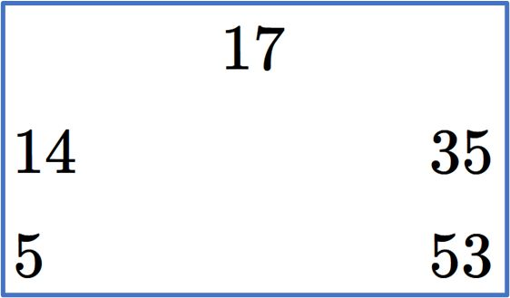
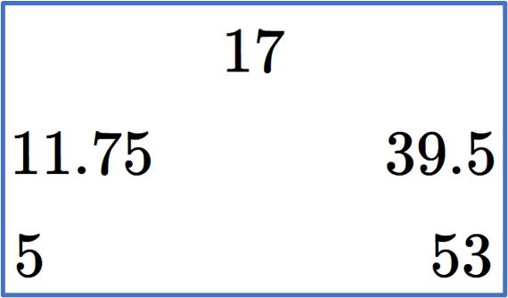
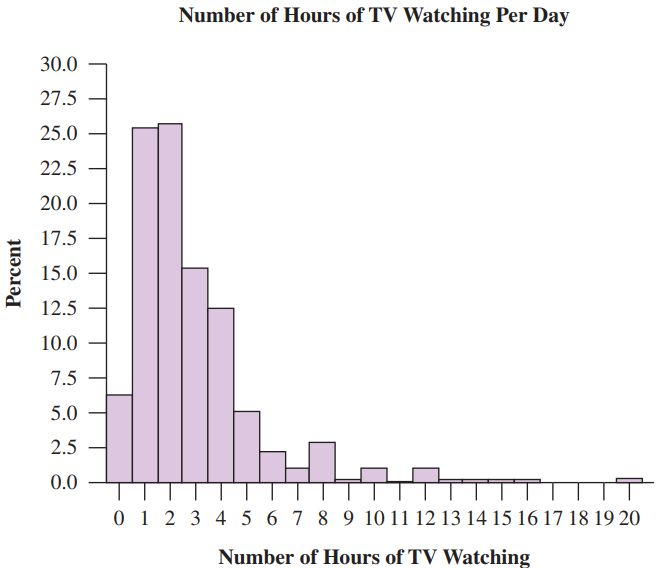
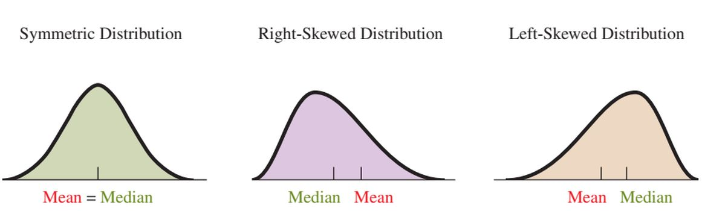
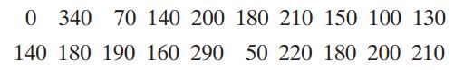

```{r xaringanExtra, echo=FALSE}
xaringanExtra::use_xaringan_extra(c("tile_view", "animate_css", "tachyons"))
```

```{r xaringan-panelset, echo=FALSE}
xaringanExtra::use_panelset()
```

```{r xaringan-scribble, echo=FALSE}
xaringanExtra::use_scribble()
```

```{r xaringan-logo, echo=FALSE}
xaringanExtra::use_logo(
  image_url = "Unsera.png"
)
```

```{r xaringanExtra-webcam, echo=FALSE}
xaringanExtra::use_webcam()
```

```{r xaringanExtra-search, echo=FALSE}
xaringanExtra::use_search(show_icon = TRUE)
```


.pull-left[


]

.pull-right[
<br>
# **.purple[Outline]**

# 1. Ukuran pemusatan data
# 2. Ukuran penyebaran data
# 3. Diagram Kotak Garis

]

---

.pull.center[
# **Peringkasan Data**
]
.pull-left[

# Ukuran Pemusatan Data

## Suatu gambaran/informasi yang memberikan penjelasan bahwa data memiliki satu/lebih titik dimana dia memusat/terkumpul


]

.pull-right[

## Jenis ukuran pemusatan data

1. ## Mean (rataan, rata-rata)
1. ## Median
1. ## Kuartil 
1. ## Modus

]

---

.pull.center[
# **Mean (rataan, rata-rata)**
]

.pull-left[

### Merupakan pusat massa (centroid) dari sekumpulan data. Rata-rata memiliki sifat-sifat berikut:
1. ### Digunakan untuk tipe data numerik
1. ### Tidak bisa digunakan untuk tipe data kategorik dan diskret
1. ### Mudah terpengaruh oleh adanya pencilan

]
.pull-right[

### Rata-rata populasi

$$
\mu=\frac{1}{N}{\sum_{i=1}^{N}x_i}
$$
dengan $N$ adalah banyaknya anggota populasi

### Rata-rata sampel
$$
\bar{x}=\frac{1}{n}{\sum_{i=1}^{n}x_i}
$$
dengan $n$ adalah banyaknya anggota contoh (sampel)
]

---

.pull-left[

**Contoh 1**

Berikut adalah nilai Ujian Tengah Semester Statistika dari 5 mahasiswa Teknik Informatika Unsera.

$80 \hspace{1cm}85 \hspace{1cm}85 \hspace{1cm}90 \hspace{1cm}85$

Hitunglah rata-rata nilai UTS kelima mahasiswa tersebut.

*Penyelesaian*:

$$
\begin{align*}
\bar{x}&=\frac{1}{n}{\sum_{i=1}^{n}x_i}\\
&=\frac{1}{5}{\sum_{i=1}^{5}x_i}\\
&=\frac{1}{5}(80+85+85+85+90+85)\\
&=\frac{1}{5}(425)\\
&=85
\end{align*}
$$
]

.pull-right[

**Contoh 2**

Pada ujian akhir Mata Kuliah Statistika kelas A, terdapat 5 orang mendapatkan nilai 45, 3 orang mendapatkan nilai 50, 7 orang mendapatkan nilai 60, 5 orang mendapatkan nilai 70, 4 orang mendapatkan nilai 75, dan 4 orang mendapatkan nilai 90. Hitunglah rata-rata nilai ujian akhir Statistika di kelas A tersebut.

*Penyelesaian*

|*x* (= nilai)|45|50|60|70|75|90|
|:-:|
|*f* (= frekuensi)|5|3|7|5|4|4|

$$
\begin{align*}
\bar{x}&=\frac{\sum f_ix_i}{\sum f_i}\\
&=\frac{45(5)+50(3)+60(7)+70(5)+75(4)+90(4)}{5+3+7+5+4+4}\\
&=64.46
\end{align*}
$$

]

---

.pull.center[
# **Median**
]

.pull-left[

### Jika sekumpulan data diurutkan dari nilai terkecil ke nilai terbesar, maka nilai yang berada di tengah-tengah disebut .red[**Median**].

### Banyaknya data yang lebih kecil dari Median .red[**sama banyak**] dengan data yang lebih besar dari Median.

### Median tidak terpengaruh oleh adanya pencilan

]

.pull-right[

### Langkah-langkah menentukan Median

1. ###Urutkan data dari terkecil ke terbesar
1. ###Jika banyaknya data ganjil,

$$\text{Median}=X_\frac{n+1}{2}$$
1. ###Jika banyaknya data genap,

$$\text{Median}=\dfrac{X_\frac{n}{2}+X_{\frac{n}{2}+1}}{2}$$
]

---

.pull-left[

**Contoh 3**

Tentukan median untuk data pada **Contoh 1**.

*Penyelesaian*

Urutkan data dari terkecil ke terbesar

$80 \hspace{1cm}85 \hspace{1cm}85 \hspace{1cm}85 \hspace{1cm}90$<br>
$X_1 \hspace{0.8cm}X_2 \hspace{0.8cm}X_3 \hspace{0.9cm}X_4 \hspace{0.8cm}X_5$

Karena banyaknya data $n=5$ (ganjil), maka

$\text{Median}=X_\frac{n+1}{2}=X_\frac{5+1}{2}=X_3$ (data ke-3)

$80 \hspace{1cm}85 \hspace{1cm}\underbrace{85}_{\text {Median}} \hspace{1cm}85 \hspace{1cm}90$

Jadi, nilai mediannya adalah $85$.

]

--

.pull-right[

**Contoh 4**

Tentukan median untuk data berikut

$2 \hspace{1cm}8 \hspace{1cm}3 \hspace{1cm}4 \hspace{1cm}1 \hspace{1cm}8$

*Penyelesaian*

Data setelah diurutkan

$1 \hspace{1cm}2 \hspace{1cm}3 \hspace{1cm}4 \hspace{1cm}8 \hspace{1cm}8$<br>
$X_1 \hspace{0.4cm}X_2 \hspace{0.5cm}X_3 \hspace{0.5cm}X_4 \hspace{0.5cm}X_5 \hspace{0.5cm}X_6$

Karena banyaknya data $n=6$ (genap), maka

$$\begin{align*}
\text{Median}&=\frac{X_\frac{n}{2}+X_{\frac{n}{2}+1}}{2}=\frac{X_\frac{6}{2}+X_{\frac{6}{2}+1}}{2}=\frac{X_3+X_4}{2}\\
&=\frac{3+4}{2}=3.5
\end{align*}$$

$1 \hspace{1cm}2 \hspace{1cm}\underbrace{3 \hspace{1cm}4}_{\text {Median}=3.5} \hspace{1cm}8 \hspace{1cm}8$

]

---
.pull.center[

#Rata-rata VS Median

]

.pull-left[

Perhatikan kembali data pada **Contoh 1**.

$80 \hspace{1cm}85 \hspace{1cm}85 \hspace{1cm}85 \hspace{1cm}90$<br>
$X_1 \hspace{0.8cm}X_2 \hspace{0.8cm}X_3 \hspace{0.9cm}X_4 \hspace{0.8cm}X_5$

Data tersebum memiliki nilai rata-rata yang sama dengan Median, yaitu 85.

Apa yang terjadi dengan rata-rata dan median jika data terkecil diganti dengan $10$? 

$10$ adalah nilai yang cukup jauh dari kumpulan nilai lainnya dan bisa dikategorikan sebagai pencilan (*outlier*)

]

--

.pull-right[

$10 \hspace{1cm}85 \hspace{1cm}85 \hspace{1cm}85 \hspace{1cm}90$<br>
$X_1 \hspace{0.8cm}X_2 \hspace{0.8cm}X_3 \hspace{0.9cm}X_4 \hspace{0.8cm}X_5$

Setelah $X_1$ diganti menjadi $10$, mediannya tetap $85$ dan rata-ratanya adalah

$$
\begin{align*}
\bar{x}&=\frac{1}{n}{\sum_{i=1}^{n}x_i}=\frac{1}{5}(10+85+85+85+90+85)\\
&=\frac{1}{5}(425)=71
\end{align*}
$$
Jadi, .red[**median resisten terhadap pencilan**] sedangkan .red[**rata-rata tidak resisten pencilan**]
]

---

.pull.center[
# **Kuartil**
]

.pull-left[

### Nilai-nilai yang menyekat data terurut menjadi 4 kelompok data yang sama banyak.

- ### Terdiri atas $Q_1$, $Q_2$, dan $Q_3$.
- ### $Q_1$ (kuartil 1) adalah nilai yang membagi data 25% di kiri dan 75% di kanan
- ### $Q_2$ (kuartil 2 atau .red[**median**]) adalah nilai yang membagi data 50% di kiri dan 50% di kanan
]

.pull-right[

- ### $Q_3$ (kuartil 3) adalah nilai yang membagi data 75% di kiri dan 25% di kanan



]

---

.pull.center[
# ** Langkah-Langkah Menentukan Kuartil**
]

### 1. Metode Belah Dua

.pull-left[

- Urutkan data dari terkecil ke terbesar dan cari nilai median-nya
- Gunakan nilai median untuk membagi data menjadi dua kelompok sama banyak.
  - Jika banyaknya data awal adalah **ganjil**, bagi data menjadi dua bagian dengan **nilai median tidak diikutkan**
  - Jika banyaknya data awal adalah **genap**, bagi data menjadi dua bagian
- Nilai $Q_1$ adalah median dari kelompok data pertama. Nilai $Q_3$ adalah median dari kelompok data kedua.
]

--

.pull-right[

**Banyaknya data ganjil**

$\underbrace{X_1 \hspace{1cm}... \hspace{1cm}X_{\frac{n+1}{2}-1}}_{Q_1=\text{Median}} \hspace{1cm}X_\frac{n+1}{2} \hspace{1cm}\underbrace{X_{\frac{n+1}{2}+1} \hspace{1cm}...\hspace{1cm}X_n}_{Q_3=\text{Median}}$

<br><br>
**Banyaknya data genap**

$\underbrace{X_1 \hspace{1cm}... \hspace{1cm}X_{\frac{n}{2}}}_{Q_1=\text{Median}} \hspace{1cm}\underbrace{X_{\frac{n}{2}+1} \hspace{1cm}...\hspace{1cm}X_n}_{Q_3=\text{Median}}$

]

---

.pull-left[

** Contoh 5**

Tentukan nilai $Q_1$, $Q_2$, dan $Q_3$ dari data berikut.

$10 \hspace{1cm}13 \hspace{1cm}24 \hspace{1cm}26 \hspace{1cm}30$

*Penyelesaian*

Banyaknya data adalah $n=5$ dan data sudah terurut.

$10 \hspace{1cm}13 \hspace{1cm}24 \hspace{1cm}26 \hspace{1cm}30$
<br>
$X_1 \hspace{0.8cm}X_2 \hspace{0.8cm}X_3 \hspace{0.9cm}X_4 \hspace{0.8cm}X_5$

Karena $n=5$ (ganjil), maka $$\text{Median}=Q_2=X_\frac{n+1}{2}=X_\frac{5+1}{2}=X_3=24$$

Kumpulan data dibagi menjadi dua kelompok dengan tidak mengikutkan median atau $Q_2$

$\underbrace{10 \hspace{1cm}13}_{\text{Kel 1}} \hspace{1cm}24 \hspace{1cm}\underbrace{26 \hspace{1cm}30}_{\text{Kel 2}}$

]

--

.pull-right[

<br><br><br><br>
Kuartil 1 atau $Q_1$ adalah median dari Kelompok 1. 

$10 \hspace{1cm}13$<br>
$X_1 \hspace{0.9cm}X_2$

Karena banyaknya data pada kelompok 1 adalah $n=2$, maka

$$
\begin{align*}
Q_1&=\dfrac{X_\frac{n}{2}+X_{\frac{n}{2}+1}}{2}=\dfrac{X_\frac{2}{2}+X_{\frac{2}{2}+1}}{2}=\dfrac{X_1+X_2}{2}\\
&=\dfrac{10+13}{2}=11.5
\end{align*}
$$
Kuartil 3 atau $Q_3$ adalah median dari Kelompok 2. Dengan cara yang sama, maka diperoleh

$Q_3=28$

]

---

.pull-left[

** Contoh 6**

Tentukan nilai $Q_1$, $Q_2$, dan $Q_3$ dari data berikut.

$18 \hspace{1cm}53 \hspace{1cm}14 \hspace{1cm}16 \hspace{1cm}35 \hspace{1cm}5$

*Penyelesaian*

Berikut adalah data yang sudah diurutkan.

$5 \hspace{1cm}14 \hspace{1cm}16 \hspace{1cm}18 \hspace{1cm}35 \hspace{1cm}53$
<br>
$X_1 \hspace{0.6cm}X_2 \hspace{0.8cm}X_3 \hspace{0.9cm}X_4 \hspace{0.8cm}X_5 \hspace{0.8cm}X_6$

Karena $n=6$ (genap), maka Median $$Q_2=\dfrac{X_\frac{n}{2}+X_{\frac{n}{2}+1}}{2}=\dfrac{X_3+X_4}{2}=\dfrac{16+18}{2}=17$$

Karena $n=6$ (genap), maka kumpulan data langsung dibagi menjadi dua kelompok

$\underbrace{5 \hspace{1cm}14 \hspace{1cm}16}_{\text{Kel 1}} \hspace{1cm}\underbrace{18 \hspace{1cm}35 \hspace{1cm}53}_{\text{Kel 2}}$

]

.pull-right[

<br><br><br><br>
Kuartil 1 atau $Q_1$ adalah median dari Kelompok 1. 

$5 \hspace{1cm}14 \hspace{1cm}16$<br>
$X_1 \hspace{0.6cm}X_2 \hspace{0.8cm}X_3$

Karena banyaknya data pada kelompok 1 adalah $n=3$ (ganjil), maka

$$
\begin{align*}
Q_1&=X_\frac{n+1}{2}=X_\frac{3+1}{2}=X_2=14
\end{align*}
$$
Kuartil 3 atau $Q_3$ adalah median dari Kelompok 2. Dengan cara yang sama, maka diperoleh

$Q_3=35$
]


---

.pull.center[
# ** Langkah-Langkah Menentukan Kuartil**
]

### 2. Dengan interpolasi

.pull-left[
- Urutkan data dari terkecil ke terbesar
- Posisi kuartil ke-i adalah $\dfrac{i(n+1)}{4}=a.b$ dengan $i=1,2,3$
- Kuartil ke-i adalah $$Q_i=X_a+0.b(X_{a+1}-X_a)$$

Lihat kembali data pada **Contoh 6** yang sudah terurut.

$5 \hspace{1cm}14 \hspace{1cm}16 \hspace{1cm}18 \hspace{1cm}35 \hspace{1cm}53$
<br>
$X_1 \hspace{0.6cm}X_2 \hspace{0.8cm}X_3 \hspace{0.9cm}X_4 \hspace{0.8cm}X_5 \hspace{0.8cm}X_6$

]

.pull-right[
Posisi kuartil ke-1 adalah $\dfrac{1(n+1)}{4}=1.75$, maka $a=1$ dan $b=75$

Kuartil ke-1 adalah 
$$\begin{align*}
Q_1&=X_a+0.b(X_{a+1}-X_a)=X_1+0.75(X_2-X_1)\\
&=5+0.75(14-5)=11.75
\end{align*}$$

Dengan cara yang sama didapat $Q_2=17$ dan $Q_3=39.5$

]

---

.pull.center[
# **Statistik 5 Serangkai**
<br>



]


---

.pull-left[

**Contoh 7**

Buatlah statistik 5 serangkai untuk data pada **Soal 6** menggunakan kuartil metode belah dua.

*Penyelesaian*

<br><br>


]

--

.pull-right[**Contoh 8**

Buatlah statistik 5 serangkai untuk data <br>pada **Soal 6** menggunakan interpolasi.

*Penyelesaian*

<br><br>



]

---

.pull.center[
# **Modus**
]

## Nilai data yang paling sering terjadi (frekuensi paling tinggi)

- ### Dalam satu gugus data dapat mengandung lebih dari satu modus
- ### Dapat digunakan untuk semua jenis data, tapi paling banyak digunakan untuk data kategorik atau data diskret dengan hanya sedikit nilai yang mungkin muncul

---

.pull.center[
# **Modus**
]

.pull-left[

]

--

.pull-right[

<br><br><br>
## Tentukan .red[**modus**] dari data di samping.
]

---

.pull.center[
# **Modus**
]

.pull-left[

### In the 2008 General Social Survey, 2020 respondents answered the question, “How many children have you ever had?” The results were

|# Children|0|1|2|3|4|5|6|7|8+|
|---|
|Count|521|323|524|344|160|77|30|19|22|

]

--

.pull-right[

<br><br><br>
## Tentukan .red[**modus**] dari data di samping.
]

---

.pull.center[
# **Hubungan Mean, Median, dan Modus**#




]

--

.pull.center[
## Di manakan .red[**posisi Modus**]?
]

---

.pull.center[
# **Peringkasan Data**
]

.pull-left[

# Ukuran Penyebaran Data

## Gambaran seberapa besar data menyebar dalam kumpulannya

]

--

.pull-right[

## Jenis ukuran penyebaran data

1. ## Jangkauan (*range*)
1. ## Jangkauan Antar Kuartil
1. ## Ragam (*variance*)
1. ## Simpangan Baku (*standard deviation*)
]

---

.pull.center[
# Ukuran Penyebaran Data
]
.pull-left[
## Jangkauan (*range*)

### Selisih pengamatan terbesar dengan pengamatan terkecil
### $R=X_{max}-X_{min}$
- Hanya memperhitungkan nilai terkecil dan terbesar, sedangkan sebaran
nilai antara dua nilai tersebut tidak diperhitungkan
- Resisten terhadap nilai yang ekstrim

]

.pull-right[

## Jangkauan Antar Kuartil

### Selisih antara kuartil 3 dengan kuartil 1
### $JAK=Q_3-Q_1$

- Memperhitungkan sebaran antara nilai minimum dan nilai maksimum
- Kekar terhadap adanya nilai-nilai yang ekstrim (pencilan)
]

---

.pull-left[
**Contoh 9**

Investigation was conducted to investigate the sodium level
in 20 breakfast cereals The observations (in mg) are



1. Figure out the median, $Q_1$, $Q_2$, and $Q_3$ of the data
1. Figure out the range and interquartile range of the data
1. Construct Five-Number Summary of the data (Statistik 5 Serangkai)


*Penyelesaian*

Data setelah diurutkan dari terkecil ke terbesar

| $X_1$ | $X_2$ | $X_3$ | $X_4$ | $X_5$ | $X_6$ | $X_7$ | $X_8$ | $X_9$ | $X_{10}$ |
|:-:|:-:|:-:|:-:|:-:|:-:|:-:|:-:|:-:|:-:|
|0 |50 |70 |100 |130 |140 |140 |150 |160 |180|
| $X_{11}$ | $X_{12}$ | $X_{13}$ | $X_{14}$ | $X_{15}$ | $X_{16}$ | $X_{17}$ | $X_{18}$ | $X_{19}$ | $X_{20}$ |
|180 |180 |190 |200 |200 |210 |210 |220 |290 |340|

]

.pull-right[
<br><br>
- Median
  
  Banyaknya data adalah $n=20$ (genap), maka $Q_2=\dfrac{X_\frac{n}{2}+X_{\frac{n}{2}+1}}{2}=\dfrac{180+180}{2}=180$
- $Q_1$ dan $Q_3$

  Karena banyaknya data adalah **genap**, data terurut bisa langsung dibagi menjadi dua kelompok.
  
  $\underbrace{X_1 \hspace{1cm}...\hspace{1cm}{X_{10}}}_{\text{Kelompok 1}} \hspace{1cm}\underbrace{X_{11} \hspace{1cm}...\hspace{1cm}{X_{20}}}_{\text{Kelompok 2}}$
- Jangkauan
- Jangkauan Antar Kuartil
- Statistik 5 Serangkai
]